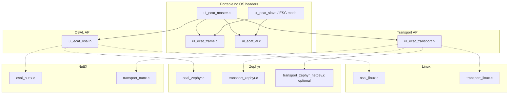
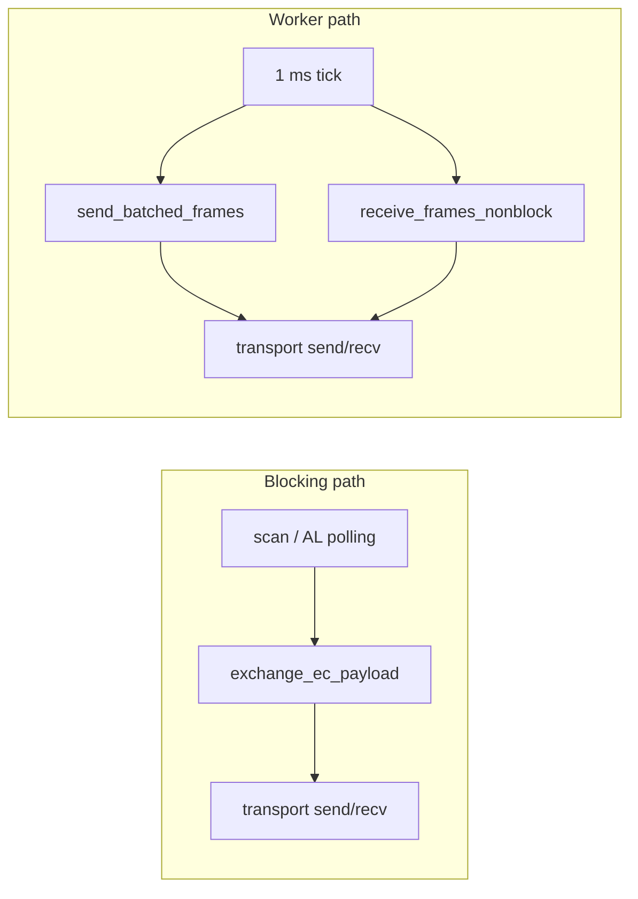

# Architecture

This document describes **layers**, **platform boundaries**, and **runtime behavior** of `ul_ecat`. Wire-level field layouts are summarized in [`mental-model.md`](mental-model.md).

## Overview: portable core vs platform glue

The **master** and **frame/AL** code are shared across Linux, Zephyr, and NuttX. Anything that depends on the kernel or RTOS (mutexes, threads, monotonic time, raw sockets) lives behind two narrow interfaces:

| Interface | Header | Responsibility |
|-----------|--------|----------------|
| **OSAL** | [`include/ul_ecat_osal.h`](../include/ul_ecat_osal.h) | Mutexes (trx / queue / event loop), worker thread, monotonic time, sleep, condition wait/signal for the event queue |
| **Transport** | [`include/ul_ecat_transport.h`](../include/ul_ecat_transport.h) | Open/close a packet socket, send/recv Ethernet frames, wait until readable (with timeout) |

Implementations are **selected at link time** (each build links exactly one OSAL + one transport for the chosen OS).

## Layer responsibilities

### 1. Wire format (`ul_ecat_frame.c` / `ul_ecat_frame.h`)

- Build Ethernet frames with EtherCAT ethertype `0x88A4`.
- Encode/decode EtherCAT PDU length + datagrams (little-endian, WKC after data).
- **Does not** open sockets or call the OS; pure bytes in/out.

### 2. AL helpers (`ul_ecat_al.c` / `ul_ecat_al.h`)

- AL Control / AL Status bit masks, acknowledge handshake, error indication.
- Used by the master and unit tests; **no** network I/O.

### 3. Master core (`ul_ecat_master.c`)

- Slave database, **scan** (APWR station address + identity reads), **blocking** AL polling (FPRD/FPWR/APWR) via `exchange_ec_payload`.
- Optional **DC** queue and minimal sync logic when enabled.
- **Batched send** and **non-blocking receive** on the worker path; **event loop** for DC/frame callbacks (`ul_ecat_eventloop_run`).
- **Depends only** on OSAL + transport + frame + AL — **no** direct `linux/*`, `zephyr/*`, or NuttX-specific headers.

### 4. OSAL (implementation files under `src/osal/`)

| Function group | Role |
|----------------|------|
| `ul_ecat_osal_*_lock/unlock` (trx, q, evt) | Serialize access to the socket path, datagram queue, and event queue |
| `ul_ecat_osal_worker_start` / `join` | Background thread for 1 ms cyclic work (DC hook, batch TX, non-blocking RX) |
| `ul_ecat_osal_monotonic_ns`, `sleep_us`, `sleep_until_ns` | Timebase for DC comparison and periodic cadence |
| `ul_ecat_osal_evt_wait` / `signal` | Block `ul_ecat_eventloop_run` until an event is posted |
| `ul_ecat_osal_realtime_hint` | Best-effort RT scheduling (Linux: `mlockall` + `SCHED_FIFO`; Zephyr: log; NuttX: pthread scheduling without locked memory) |

### 5. Transport (implementation files under `src/transport/`)

| Function | Role |
|----------|------|
| `ul_ecat_transport_open` | Create packet socket, bind to named interface for EtherCAT ethertype |
| `send` / `recv` | Full Ethernet frames (built by `ul_ecat_frame`) |
| `wait_readable` | Used for blocking exchanges (scan/AL) and polling in non-blocking RX |

Zephyr optionally swaps **TX** to `net_if_queue_tx` via [`transport_zephyr_netdev.c`](../src/transport/transport_zephyr_netdev.c) when `CONFIG_UL_ECAT_TRANSPORT_NETDEV` is set; RX still uses the packet socket.

## Data paths

Two interaction patterns share the same transport but use different locking:

- **Blocking path:** holds the **trx** OSAL lock for the full send + wait + recv used during discovery and AL state changes.
- **Worker path:** same trx lock around batch send and non-blocking receive; **queue** lock protects the internal datagram queue only.

## Threads and locking

- A **worker thread** (started in `ul_ecat_master_init`) runs `dc_cycle`, `ul_ecat_send_batched_frames`, and `ul_ecat_receive_frames_nonblock` on a configurable **1 ms** cadence (`CYCLE_TIME_NS` in the master source).
- **Trx mutex:** serializes raw socket use between the worker and **blocking** exchanges (so scan/CLI does not race the cyclic path).
- **Queue mutex:** protects the fixed-size datagram queue (`Q_MAX`); no per-datagram `malloc` on the hot path.
- **Event mutex + wait/signal:** feeds `ul_ecat_eventloop_run()` in the application thread; callbacks should not block the worker if you extend the design.

## Event loop

DC and raw frame events are posted to a **bounded queue** (`MAX_EVENTS`). The application calls `ul_ecat_eventloop_run()` and registers callbacks via `ul_ecat_register_dc_callback` / `ul_ecat_register_frame_callback`.

## File map by platform

| Component | Linux | Zephyr | NuttX |
|-----------|-------|--------|-------|
| OSAL | `src/osal/osal_linux.c` | `src/osal/osal_zephyr.c` | `src/osal/osal_nuttx.c` |
| Transport | `src/transport/transport_linux.c` | `src/transport/transport_zephyr.c` (or `transport_zephyr_netdev.c`) | `src/transport/transport_nuttx.c` |
| Build entry | Root [`CMakeLists.txt`](../CMakeLists.txt) | [`zephyr/CMakeLists.txt`](../zephyr/CMakeLists.txt) | [`nuttx/Make.defs`](../nuttx/Make.defs) / [`nuttx/ul_ecat_sources.cmake`](../nuttx/ul_ecat_sources.cmake) |

Integration steps for RTOS builds: [README § Quick start](../README.md#quick-start-zephyr-and-nuttx), [`zephyr-module.md`](zephyr-module.md), [`nuttx-module.md`](nuttx-module.md).

## EtherCAT slave library (`libul_ecat_slave`)

The **slave** side is a separate static library that reuses the same **wire** encode/decode (`src/common/ul_ecat_frame.c`, `src/common/ul_ecat_al.c`) via the internal **`ul_ecat_wire`** CMake target. It does **not** use OSAL or transport.

| Piece | Role |
|-------|------|
| `src/slave/ul_ecat_esc.c` | Byte mirror of ESC registers; identity and AL Status defaults |
| `src/slave/ul_ecat_slave_pdu.c` | Walk input datagrams, apply **FPRD / FPWR / APWR**, build reply PDU with WKC |
| `src/slave/ul_ecat_slave.c` | `ul_ecat_slave_process_ethernet`: parse Ethernet, call PDU handler, rebuild reply frame |
| `generated/ul_ecat_slave_tables.c` | Optional committed identity from [`scripts/gen_slave_data.py`](../scripts/gen_slave_data.py) |

See [`slave-architecture.md`](slave-architecture.md) and [`slave-mental-model.md`](slave-mental-model.md).

## Host simulator (TCP harness + Python controller)

For tests without raw Ethernet, `tools/ul_ecat_slave_harness` listens on **127.0.0.1** and exchanges **length-prefixed** raw Ethernet frames. The **EtherCAT controller simulator** ([`scripts/ethercat_controller_sim.py`](../scripts/ethercat_controller_sim.py)) connects as a client and runs the same **scan sequence** as the C master (APWR station, FPRD identity). Details: [`simulator.md`](simulator.md).

## Related documents

- [`mental-model.md`](mental-model.md) — PDU/datagram/WKC/AL field layout (master-centric)
- [`slave-mental-model.md`](slave-mental-model.md) — slave view of ADP/ADO and WKC
- [`slave-architecture.md`](slave-architecture.md) — slave layers and files
- [`simulator.md`](simulator.md) — TCP framing and controller simulator
- [`porting-guide.md`](porting-guide.md) — adding a new OSAL/transport pair
- [`repository-layout.md`](repository-layout.md) — directory tree
