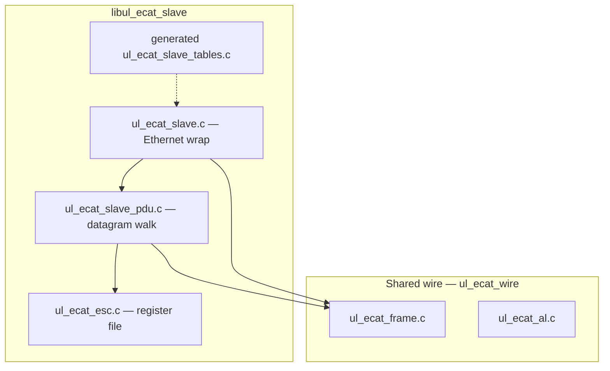

# Slave stack architecture

This document describes the **minimal EtherCAT slave** implementation in `ul_ecat`: ESC register mirror, PDU handling, and how it depends on the shared wire-format layer.

## Goals (phase 1)

- Parse incoming EtherCAT **PDU datagrams** using the same layout as the master (`ul_ecat_frame.h`).
- Maintain a **byte-addressable ESC RAM** mirror (4 KiB) with identity registers, configured station address, and AL Control / Status.
- Build **reply Ethernet frames** (EtherType `0x88A4`) with updated datagram data and **WKC** per processed datagram.
- No hardware driver, no full EEPROM/SII in this phase unless a future test requires it.

## Layering

- **`ul_ecat_slave_process_ethernet`** validates the Ethernet header and EtherType, extracts the ECAT payload, calls **`ul_ecat_slave_process_pdu`**, then **`ul_ecat_build_eth_frame`** with the slave’s MAC as source and the received frame’s source as destination (reply to master).
- **`ul_ecat_slave_process_pdu`** iterates datagrams with `ul_ecat_pdu_count_datagrams` / `ul_ecat_dgram_parse`, dispatches **FPRD / FPWR / APWR**, and re-encodes each datagram with **`ul_ecat_dgram_encode`** and the new WKC/data.

## Identity and tables

Default identity for the harness and generated tables is produced by **`scripts/gen_slave_data.py`**, which writes `generated/ul_ecat_slave_tables.{c,h}` and prints a review table. CMake target **`ul_ecat_regen_slave_tables`** runs the generator on demand.

## Application layer: `ul_ecat_slave_controller`

[`ul_ecat_slave_controller.h`](../include/ul_ecat_slave_controller.h) provides a single place to:

- Initialize the slave mirror and identity (`ul_ecat_slave_controller_init`).
- **Software path** (`UL_ECAT_SLAVE_BACKEND_SOFTWARE_ETHERNET`): call `ul_ecat_slave_controller_process_ethernet` (wraps `ul_ecat_slave_process_ethernet`), then `ul_ecat_slave_controller_poll` to dispatch **AL Status** / **AL Event** callbacks from the updated mirror.
- **LAN9252 path** (`UL_ECAT_SLAVE_BACKEND_LAN9252_SPI`): `ul_ecat_slave_controller_poll` performs **SPI** reads/writes via [`lan9252.h`](../controllers/lan9252/include/lan9252.h) into the same mirror for registers below `0x1000`, and optional **PDRAM** slices via `ul_ecat_slave_controller_set_pdram` (ETG addresses `0x1000+` do not fit the 4 KiB `esc[]` array; PDO uses separate buffers). On real hardware the ESC terminates Ethernet; the MCU does not parse raw datagrams off the wire. On **Linux** CMake builds, this path is compiled when `UL_ECAT_BUILD_LAN9252` links the chip driver; on **Zephyr/NuttX**, use the HAL ports in [`doc/rtos-lan9252.md`](rtos-lan9252.md) (no Linux slave SPI HAL in-tree yet).

Identity visible to a real master comes from **EEPROM/SII** on the ESC, not only from the software mirror.

## Related documents

- [`rtos-lan9252.md`](rtos-lan9252.md) — Zephyr (`/chosen ul-ecat-spi`, SYS_INIT) and NuttX (SPI0) HAL for LAN9252
- [`slave-mental-model.md`](slave-mental-model.md) — addressing and WKC from the slave perspective
- [`architecture.md`](architecture.md) — overall project layers
- [`simulator.md`](simulator.md) — TCP harness and Python controller simulator
